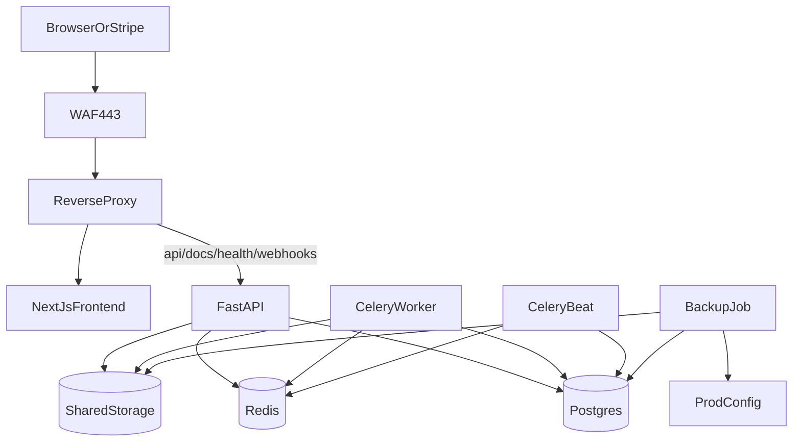

# ListingLive 生产部署手册

本文档适用于：单台 Linux 虚拟机、上游 WAF 终止 SSL、单域名单入口对外暴露的生产部署场景。

## 1. 这套部署方案能提供什么

- 前端、后端、worker、beat、数据库、Redis 的单机生产部署
- 一键部署与一键更新
- 上传文件与生成视频的共享持久化存储
- 自动备份与回滚工具
- 可用于真实 Stripe webhook 联调的正式环境
- 在补齐邮箱服务商参数后，可用于真实 SMTP 邮件发送测试

## 2. 仓库里新增的生产文件

- [`docker-compose.prod.yml`](../docker-compose.prod.yml)
- [`frontend/Dockerfile.prod`](../frontend/Dockerfile.prod)
- [`deploy/nginx/listinglive.conf`](../deploy/nginx/listinglive.conf)
- [`scripts/prod/init-host.sh`](../scripts/prod/init-host.sh)
- [`scripts/prod/deploy.sh`](../scripts/prod/deploy.sh)
- [`scripts/prod/backup.sh`](../scripts/prod/backup.sh)
- [`scripts/prod/rollback.sh`](../scripts/prod/rollback.sh)
- [`deploy/systemd/listinglive-backup.service`](../deploy/systemd/listinglive-backup.service)
- [`deploy/systemd/listinglive-backup.timer`](../deploy/systemd/listinglive-backup.timer)
- [`.env.prod.example`](../.env.prod.example)

## 3. 推荐的 VM 目录结构

```text
/opt/listinglive/
  app/          # Git 代码目录
  config/       # 真实生产配置，不进 Git
  data/
    storage/    # 上传图、logo、生成视频
  backups/      # 数据库、存储、配置备份
  logs/         # 部署状态和主机侧日志
```

下面这些内容不要提交到 Git，也不要在更新时被覆盖：

- `/opt/listinglive/config/.env.prod`
- `/opt/listinglive/config/ai_provider.toml`
- `/opt/listinglive/data/storage`
- Docker 卷 `listinglive_pgdata`

## 4. 运行架构



## 5. 首次初始化主机

### 5.1 前置条件

- 一台可控的 Linux VM
- 具备 `sudo` 权限
- 域名已准备好
- WAF 可以把公网域名流量转发到这台 VM

### 5.2 执行初始化脚本

初始化脚本会安装基础依赖、安装 Docker、创建目录、拉代码、生成初始配置模板、安装备份定时器。

如果你希望直接从 GitHub 拉脚本执行：

```bash
curl -fsSL https://raw.githubusercontent.com/devB2433/listinglive/main/scripts/prod/init-host.sh -o /tmp/listinglive-init-host.sh
sudo bash /tmp/listinglive-init-host.sh
```

如果你已经手动把仓库 clone 到 VM：

```bash
cd /opt/listinglive/app
sudo ./scripts/prod/init-host.sh
```

### 5.3 初始化脚本具体做什么

1. 安装基础包，例如 `git`、`curl`、Docker
2. 设置 Docker 开机自启
3. 创建 `/opt/listinglive/{app,config,data/storage,backups,logs}`
4. clone 或更新仓库到 `/opt/listinglive/app`
5. 如果缺失，则复制 `.env.prod.example` 到 `/opt/listinglive/config/.env.prod`
6. 如果缺失，则复制 `config/ai_provider.toml.example` 到 `/opt/listinglive/config/ai_provider.toml`
7. 安装备份定时器并启用

### 5.4 重新登录一次

初始化脚本会把当前用户加入 Docker 组。执行完后建议重新登录一次，避免后续执行 Docker 命令时还需要 `sudo`。

## 6. 生产配置

### 6.0 到底需要填写几个配置文件

按照这套方案，你真正需要手动维护的生产配置文件只有 **2 个**：

1. `/opt/listinglive/config/.env.prod`
2. `/opt/listinglive/config/ai_provider.toml`

可选文件：

3. `/opt/listinglive/config/stripe_price_ids.local.json`

第三个文件只有在你想用“本地 JSON 文件管理 Stripe Price ID，再同步到数据库”的方式时才需要。系统正常运行并不强制依赖它。
如果你需要在生产容器里执行同步脚本，`api` 容器会只读挂载整个 `/opt/listinglive/config` 到 `/run/listinglive/config`，因此该文件在容器内可通过下面的路径访问：

```text
/run/listinglive/config/stripe_price_ids.local.json
```

### 6.1 主配置文件

需要编辑：

```text
/opt/listinglive/config/.env.prod
```

至少需要填写或确认这些值：

- `APP_DOMAIN`
- `NEXT_PUBLIC_API_URL`
- `SECRET_KEY`
- `POSTGRES_PASSWORD`
- `DATABASE_URL`
- `CORS_ORIGINS`
- `STRIPE_SECRET_KEY`
- `STRIPE_PUBLISHABLE_KEY`
- `STRIPE_WEBHOOK_SECRET`
- `STRIPE_CHECKOUT_SUCCESS_URL`
- `STRIPE_CHECKOUT_CANCEL_URL`
- `STRIPE_BILLING_PORTAL_RETURN_URL`
- `MAIL_PROVIDER`
- `MAIL_FROM`
- `SMTP_HOST`
- `SMTP_USERNAME`
- `SMTP_PASSWORD`
- `VIDEO_PROVIDER_CONCURRENCY_LIMIT`
- `CONTAINER_TIMEZONE`（如果你想手动覆盖）

如果你当前已经确定正式主域名是 `listinglive.ca`，那么下面这些值可以先直接按这个口径填写：

```dotenv
APP_DOMAIN=listinglive.ca
NEXT_PUBLIC_API_URL=https://listinglive.ca/api
CORS_ORIGINS=["https://listinglive.ca","https://www.listinglive.ca"]
STRIPE_CHECKOUT_SUCCESS_URL=https://listinglive.ca/billing?checkout=success
STRIPE_CHECKOUT_CANCEL_URL=https://listinglive.ca/billing?checkout=cancel
STRIPE_BILLING_PORTAL_RETURN_URL=https://listinglive.ca/billing
MAIL_FROM=hello@listinglive.ca
MAIL_REPLY_TO=hello@listinglive.ca
SMTP_USERNAME=hello@listinglive.ca
```

上面这部分属于“已知可先写死”的配置；真正还需要你后续补齐的是密钥、密码、SMTP 主机等敏感参数。

### 6.1.0 容器时区

现在这套生产脚本会在启动时自动读取 **Linux 宿主机时区**，并把同一个时区传给：

- `reverse-proxy`
- `frontend`
- `postgres`
- `redis`
- `api`
- `worker`
- `beat`

同时会把宿主机的 `/etc/localtime` 只读挂载进生产容器，尽量确保容器内时间显示、日志时间和宿主机一致。

一般情况下你 **不用手动填写** `CONTAINER_TIMEZONE`。  
只有当你想强制覆盖宿主机时区时，才在 `.env.prod` 里显式写，例如：

```dotenv
CONTAINER_TIMEZONE=America/Toronto
```

### 6.1.1 第三方并发限制建议

如果你的上游视频生成服务明确给出的并发上限是 **10**，建议本地队列门不要直接也设成 `10`，而是先从：

```dotenv
VIDEO_PROVIDER_CONCURRENCY_LIMIT=8
```

开始。

原因：

- 给第三方偶发抖动、超时重试、恢复中的任务留余量
- 避免在 Redis 刚恢复、worker 重启、短时间批量提交时直接把上游打满
- 用户优先看到 ListingLive 自己的本地排队，而不是全部挤进上游黑盒排队

当前代码已经改成：**Redis 队列门不可用时，不再放行任务继续请求第三方**，而是直接失败并提示稍后重试。这样可以避免限流保护失效时把第三方并发冲爆。

### 6.1.2 本地压测专用延时参数

下面这个参数只用于开发机或压测环境模拟“单任务处理很久”的情况：

```dotenv
LOCAL_VIDEO_PROVIDER_DELAY_SECONDS=0
```

说明：

- 生产环境保持 `0`
- 例如设成 `120`，表示本地 `local` provider 每个任务在真正生成前额外等待 120 秒
- 这个参数只对本地 provider 生效，不会改变正式第三方 provider 的真实行为

### 6.2 AI provider 配置文件

需要编辑：

```text
/opt/listinglive/config/ai_provider.toml
```

这个文件里需要放你真实的模型接入信息，例如：

- `provider`
- `api_key`
- `model_id`
- `base_url`

### 6.3 哪些值需要你自己在 VM 上生成

有两个重要值需要你自己在 Linux VM 上生成：

- `SECRET_KEY`
- `POSTGRES_PASSWORD`

它们和 Stripe key、SMTP 密码、AI provider key 不同，不是去后台拿，而是你自己生成。

#### `SECRET_KEY` 是什么

`SECRET_KEY` 用于后端签发和校验认证 token。  
生产环境必须使用新的随机值，不能沿用默认值。

在 VM 上生成：

```bash
python3 - <<'PY'
import secrets
print(secrets.token_urlsafe(64))
PY
```

把输出结果填到：

```dotenv
SECRET_KEY=<生成出来的值>
```

#### `POSTGRES_PASSWORD` 是什么

这是 PostgreSQL 容器初始化使用的密码，同时后端连接数据库时也要用同一个密码。

在 VM 上生成：

```bash
python3 - <<'PY'
import secrets
print(secrets.token_urlsafe(32))
PY
```

然后把同一个值填到：

```dotenv
POSTGRES_PASSWORD=<生成出来的值>
DATABASE_URL=postgresql+asyncpg://listinglive:<同一个值>@postgres:5432/listinglive
```

如果你更喜欢传统的强密码格式，也可以用：

```bash
python3 - <<'PY'
import secrets, string
alphabet = string.ascii_letters + string.digits + "!@#$%^&*()-_=+"
print(''.join(secrets.choice(alphabet) for _ in range(32)))
PY
```

### 6.4 哪些值不是 VM 生成的

下面这些值不是在 VM 上生成的，而是去外部平台获取：

- Stripe：
  - `STRIPE_SECRET_KEY`
  - `STRIPE_PUBLISHABLE_KEY`
  - `STRIPE_WEBHOOK_SECRET`
- 邮箱 / SMTP 服务商：
  - `SMTP_HOST`
  - `SMTP_USERNAME`
  - `SMTP_PASSWORD`
- AI provider：
  - `api_key`
  - `model_id`
  - 供应商相关地址

这些值分别来自：

- Stripe Dashboard
- 你的邮箱服务商 / SMTP 服务商
- 你的 AI / 视频生成服务商后台

### 6.5 你的邮箱配置建议

你计划使用 `hello@listinglive.ca`，建议从下面这个模板开始：

```dotenv
MAIL_PROVIDER=smtp
MAIL_FROM=hello@listinglive.ca
MAIL_FROM_NAME=ListingLive
MAIL_REPLY_TO=hello@listinglive.ca
SMTP_HOST=<邮箱服务商提供>
SMTP_PORT=587
SMTP_USERNAME=hello@listinglive.ca
SMTP_PASSWORD=<后续填写>
SMTP_USE_TLS=true
SMTP_USE_SSL=false
```

如果你的邮箱服务商要求 SSL 直连而不是 STARTTLS：

- `SMTP_USE_SSL=true`
- `SMTP_USE_TLS=false`
- 端口通常改成 `465`

### 6.6 最小生产配置清单

第一次部署前，你至少需要准备这些真实值。

在 `/opt/listinglive/config/.env.prod` 中：

- `APP_DOMAIN`
- `NEXT_PUBLIC_API_URL`
- `SECRET_KEY`（你自己在 VM 上生成）
- `POSTGRES_PASSWORD`（你自己在 VM 上生成）
- `DATABASE_URL`（必须使用同一个数据库密码）
- `STRIPE_SECRET_KEY`
- `STRIPE_PUBLISHABLE_KEY`
- `STRIPE_WEBHOOK_SECRET`
- `STRIPE_CHECKOUT_SUCCESS_URL`
- `STRIPE_CHECKOUT_CANCEL_URL`
- `STRIPE_BILLING_PORTAL_RETURN_URL`
- `MAIL_PROVIDER`
- `MAIL_FROM`
- `SMTP_HOST`
- `SMTP_USERNAME`
- `SMTP_PASSWORD`

在 `/opt/listinglive/config/ai_provider.toml` 中：

- `provider`
- `api_key`
- `model_id`
- `base_url`（如果你的 provider 需要）

## 7. WAF 与域名配置

上游 WAF 需要做到：

- 为你的生产域名终止 SSL
- 把这个域名的全部流量转发到 VM
- 尽量保留原始 `Host` 头
- 允许 Stripe 访问同一个域名下的 webhook 路径

本应用按“单域名承载全部流量”的模式设计：

- 页面请求
- API 请求
- Stripe webhook 请求

不需要单独再开第二个公网服务。

### 7.1 主域名建议

当前建议你把 `listinglive.ca` 作为唯一主域名。

- 主域名：`listinglive.ca`
- 可选别名：`www.listinglive.ca`
- 如果启用 `www`，建议只做 `301` 跳转到 `https://listinglive.ca`

这样做的好处是：

- Stripe 回调地址统一
- 登录态、Cookie、链接口径更一致
- SEO 主域名更清晰
- WAF、证书、反向代理配置更简单

也就是说，生产配置里所有正式 URL 都优先使用 `https://listinglive.ca`。

## 8. 首次生产部署

把配置文件填好之后，执行：

```bash
cd /opt/listinglive/app
LISTINGLIVE_ENV_FILE=/opt/listinglive/config/.env.prod ./scripts/prod/deploy.sh
```

部署脚本会按下面的顺序执行：

1. 检查 Git 工作区是否干净
2. 从远端拉取最新代码
3. 创建部署前备份
4. 构建生产镜像
5. 启动 `postgres` 和 `redis`
6. 执行 `alembic upgrade head`
7. 启动 `api`、`worker`、`beat`、`frontend`、`reverse-proxy`
8. 执行健康检查
9. 写入部署状态，供回滚使用

## 9. 一键更新

### 最简方式：更新脚本

日常升级最推荐直接执行：

```bash
cd /opt/listinglive/app
bash ./scripts/prod/update.sh
```

这个脚本会默认使用：

- `/opt/listinglive/config/.env.prod`
- 当前仓库默认分支
- 生产部署脚本 `scripts/prod/deploy.sh`

常见用法：

```bash
cd /opt/listinglive/app
bash ./scripts/prod/update.sh --skip-backup
bash ./scripts/prod/update.sh --ref <git-ref>
bash ./scripts/prod/update.sh --env-file /opt/listinglive/config/.env.prod --skip-backup
```

说明：

- `update.sh` 是给运维日常使用的更短入口
- 它底层仍然调用 `deploy.sh`
- 脚本已对 Linux 上常见的脚本权限位变化做兼容，避免因为 `scripts/prod/*.sh` 的 mode 变化导致更新被错误拦截

### 方式 A：脚本自己拉代码

```bash
cd /opt/listinglive/app
bash ./scripts/prod/update.sh
```

### 方式 B：你先自己 `git pull`

```bash
cd /opt/listinglive/app
git pull --ff-only origin main
LISTINGLIVE_ENV_FILE=/opt/listinglive/config/.env.prod ./scripts/prod/deploy.sh --skip-pull
```

### 方式 C：部署到指定版本

```bash
cd /opt/listinglive/app
LISTINGLIVE_ENV_FILE=/opt/listinglive/config/.env.prod ./scripts/prod/deploy.sh --ref <git-ref>
```

## 10. 备份

### 10.1 手工备份

```bash
cd /opt/listinglive/app
LISTINGLIVE_ENV_FILE=/opt/listinglive/config/.env.prod ./scripts/prod/backup.sh
```

备份会包含：

- PostgreSQL 导出
- 共享存储目录归档
- 生产配置归档
- 备份清单文件

### 10.2 自动备份

初始化脚本已经会启用：

- `listinglive-backup.service`
- `listinglive-backup.timer`

查看状态：

```bash
systemctl list-timers listinglive-backup.timer
systemctl status listinglive-backup.timer
```

### 10.3 备份保留策略

保留策略由下面两个参数控制：

- `BACKUP_DAILY_RETENTION_DAYS`
- `BACKUP_WEEKLY_RETENTION_DAYS`

每周日会自动额外保留一份周备份。

### 10.4 建议做异机或异地备份

当前仓库已经实现了在本机生成备份，但更稳妥的做法仍然是把备份同步到 VM 之外，例如：

- 对象存储
- 另一台备份机
- 加密后的远端归档地址

## 11. 回滚

### 11.1 只回滚代码

```bash
cd /opt/listinglive/app
LISTINGLIVE_ENV_FILE=/opt/listinglive/config/.env.prod ./scripts/prod/rollback.sh
```

它会读取上一次部署状态，回到上一个 Git 版本。

### 11.2 回滚到指定版本

```bash
cd /opt/listinglive/app
LISTINGLIVE_ENV_FILE=/opt/listinglive/config/.env.prod ./scripts/prod/rollback.sh --ref <git-ref>
```

### 11.3 带数据恢复的回滚

```bash
cd /opt/listinglive/app
LISTINGLIVE_ENV_FILE=/opt/listinglive/config/.env.prod ./scripts/prod/rollback.sh --restore-data --backup-stamp <backup-stamp>
```

只有在部署或迁移影响到数据库/文件存储时，才建议使用这种方式。

## 12. Stripe 正式联调

开始测试真实 Stripe 之前，建议按这个顺序检查：

1. 应用已经通过真实域名对外可访问
2. 域名外部可访问
3. Stripe webhook 指向正式域名
4. `.env.prod` 中填入真实 Stripe key
5. Stripe 正式产品与 Price 已创建
6. 生产 Price ID 已同步到数据库或已确认存在

推荐的 webhook 地址：

```text
https://listinglive.ca/api/v1/billing/webhooks/stripe
```

建议测试顺序：

1. 订阅结账
2. Billing Portal 返回流程
3. Webhook 接收
4. 配额变更是否正确写入系统

## 13. 邮件验证码联调

SMTP 邮件发送已经接入后端。

当前行为：

- 如果 SMTP 已配置，发送验证码时会真实发邮件
- 如果 SMTP 没配置且 `DEBUG=true`，开发环境仍可回退到本地 debug 输出
- 如果 SMTP 没配置或发送失败且 `DEBUG=false`，接口会返回明确的服务错误

等你补好邮箱密码后，建议按这个顺序验证：

1. 填入真实 `SMTP_HOST` 和 `SMTP_PASSWORD`
2. 重启或重新部署
3. 从注册页触发 `send-code`
4. 确认验证码邮件能正常送达
5. 验证注册流程和重置密码流程都能使用邮件验证码

## 14. 上线前检查清单

正式上线前，建议逐项确认：

- 域名解析正确
- WAF 转发正确
- 首页能正常打开
- 通过正式域名访问 `/health` 返回正常
- 注册页能正常打开
- 验证码邮件发送成功
- Stripe Checkout 能正常打开
- Stripe webhook 能成功进入系统
- 备份定时器已启用
- 至少手工执行过一次备份
- 已提前阅读回滚脚本的使用方式

## 15. 说明

- 生产部署脚本要求 Git 工作区保持干净
- 共享存储卷必须同时挂给 `api`、`worker`、`beat`
- 不要把真实生产密钥写入仓库
